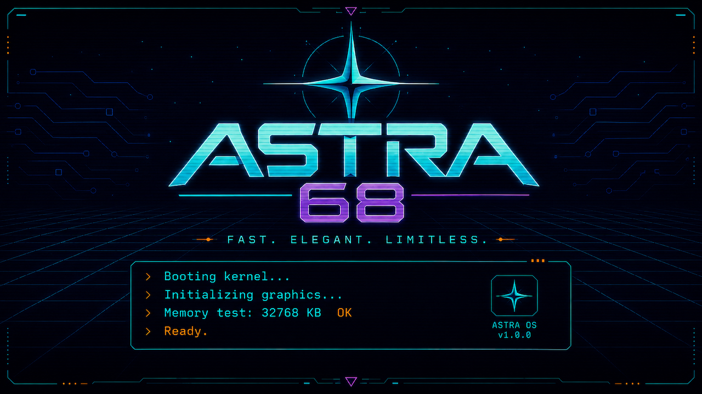

<p align="center">
  
</p>

<h1 align="center">Astra 68</h1>

<p align="center">
  <strong>A modern fantasy MC68030 computer, accelerated graphics platform,
  and operating system built from first principles.</strong>
</p>

<p align="center">
  
  
  
  
</p>

Astra 68 keeps the directness and personality of classic 68k machines while
applying what operating-system and hardware designers have learned since.
It is not an Amiga clone. It is a new big-endian machine with a protected,
preemptive kernel; a consistent service and device model; and custom FPGA
graphics designed for games and a fast graphical desktop.

The platform is **Astra 68**, the kernel is **Axiom**, and the user-facing
system is **Astra OS**.

> [!IMPORTANT]
> Astra 68 is an active engineering project, not a finished computer or a
> production-ready operating system. The repository distinguishes implemented
> behavior, simulation evidence, routed FPGA checkpoints, and hardware
> qualification. Start with [the current engineering state](docs/CURRENT_STATE.md).

## What works today

- Axiom reaches its K1-K10 protected-kernel milestones with MC68030 PMMU,
  process and thread separation, preemptive scheduling, bounded IPC and waits,
  handles and rights, shared areas, fault containment, memory pressure
  handling, device infrastructure, tracing, panic output, and performance
  gates.
- The active Arty Z7-20 machine runs the big-endian MC68030/PMMU environment on
  the Zynq ARM processing system and reserves a contiguous 128 MiB DDR arena
  for custom programmable-logic graphics.
- The hardware-qualified 1280x720p60 graphics path includes RGB565/XRGB8888/
  INDEX8 framebuffers, two independently scrolling tile layers, 64 INDEX8
  sprites up to 128x128, sixteen per-sprite palette banks, alpha and opacity,
  scaling, signed off-screen positioning, clipping, collision reporting, and
  atomic frame-boundary scene promotion.
- The bounded renderer transport, fences, descriptor validation, timeout/reset
  handling, pixel writer, clipped fills, and overlap-safe basic copies pass an
  exact full route and repeated Arty hardware tests.
- The complete blitter feature set passes directed simulation, including
  scaling, reflection, keying, MASK1, palette attachments, source-over,
  opacity, all sixteen ROPs, and supported format conversion. Its 200 MHz
  timing and integrated hardware release gates are still open.
- The Astra QEMU backend runs the active Arty machine and is the only emulator.
  The Musashi MC68030/PMMU model is retained as a conformance oracle for the
  RTL CPU, not as a machine to run Astra on.

## Direction

Astra OS is intended to be a compact, responsive graphical system with a
powerful shell and a uniform, extensible object and service model. Filesystems,
graphics policy, desktop, input policy, format handlers, audio mixing, and
other services live outside the kernel. Hot paths use shared areas, bounded
rings, coarse messages, and hardware acceleration rather than chatty RPC.

The graphics architecture ultimately includes:

- framebuffer and tile scrolling with tear-free frame transactions;
- 64 hardware sprites plus blitter-backed virtual sprites;
- copper-controlled raster effects;
- copy, compositing, ROP, geometry, pattern, and flood engines;
- hardware AFNT glyph expansion;
- wave-synthesis and PCM audio engines;
- fixed-point and game-oriented math acceleration.

The detailed contract is in
[GRAPHICS_ARCHITECTURE.md](docs/GRAPHICS_ARCHITECTURE.md). Features listed
there are architectural commitments, not all completed hardware.

## Architecture

```text
Astra applications and system services
                 |
       stable Astra NDK / service ABIs
                 |
          Axiom protected kernel
                 |
        MC68030 + PMMU environment
                 |
     bounded MMIO and shared command rings
                 |
   FPGA display, sprites, tiles, and render engines
```

The active machine uses the Arty Z7-20 processing system for CPU execution and
the FPGA fabric for specialized hardware. The retained TG68K.C MC68030/PMMU
RTL core, Musashi model, shared conformance suite, and historical ULX3S system
remain valuable behavioral and regression oracles.

## Repository map

| Path | Contents |
|---|---|
| [`docs/`](docs/) | Architecture, ABI, status, budgets, and measured timing records |
| [`sw/kernel/`](sw/kernel/) | Axiom MC68030 kernel and host-side state-machine tests |
| [`sw/boot/`](sw/boot/) | Boot ROM, splash assets, loaders, and boot contracts |
| [`ndk/`](ndk/) | Public Astra developer interfaces and generated documentation |
| [`fpga/arty/`](fpga/arty/) | Active Zynq/Arty hardware, Linux integration, and graphics RTL |
| [`fpga/cpu/`](fpga/cpu/) | Retained MC68030/PMMU RTL and conformance integration |
| [`emu/qemu/`](emu/qemu/) | The Astra QEMU machine backend |
| [`conformance/`](conformance/) | Shared architectural tests and implementation adapters |
| [`third_party/`](third_party/) | Vendored upstream components with their original notices |

## Build and test

Different parts of Astra 68 have different toolchain requirements. Useful
host-side entry points are:

```sh
# Axiom host tests
make -C sw/kernel test

# Emulator for the host, the desktop, or the Arty board
emu/qemu/build.sh host

# Directed active-graphics RTL suite (requires Icarus Verilog)
fpga/arty/graphics/run_tests.sh
```

Building the target kernel and ROM also requires an `m68k-elf` cross compiler.
FPGA release builds require Vivado 2024.2 for the Arty target. Exact lab build,
route, deployment, and rollback procedures are intentionally kept in the
component documentation because a reduced or unconstrained bitstream is not
release evidence.

See [the inventory](docs/INVENTORY.md) for the machines, boards and toolchains,
[Arty graphics](fpga/arty/graphics/README.md), and the
[shared conformance harness](conformance/README.md) for focused setup.

## Engineering rules

- Motorola MC68030 behavior is authoritative; implementation shortcuts do not
  define a new CPU dialect.
- Bounded latency, predictable memory use, failure isolation, and measurable
  performance take priority over feature count.
- Simulation success is necessary but not sufficient. FPGA features require
  constrained timing closure and physical hardware evidence.
- Performance and resource use are measured continuously before higher layers
  depend on them.
- Public ABI structures are fixed-width, big-endian, versioned, and independent
  of compiler-private C layouts.

## Documentation

- [Current engineering state](docs/CURRENT_STATE.md)
- [Kernel architecture](docs/KERNEL_ARCHITECTURE.md)
- [Kernel implementation status](docs/STATUS.md)
- [Memory map and PMMU](docs/MEMORY_MAP_AND_PMMU.md)
- [System ABI](docs/ABI.md)
- [Graphics architecture](docs/GRAPHICS_ARCHITECTURE.md)
- [Astra OS vision](docs/OS_VISION.md)
- [FPGA resource budget](docs/FPGA_RESOURCE_BUDGET.md)
- [Arty graphics timing closure](fpga/arty/graphics/TIMING_CLOSURE.md)
- [Build and test artifact policy](docs/ARTIFACT_POLICY.md)

## Licensing

No single project-wide license currently covers every Astra-authored file.
Third-party components retain the licenses and notices shipped in their
directories and source headers. Public visibility does not replace those
terms or grant additional rights; review the applicable component before
redistributing or incorporating code.
