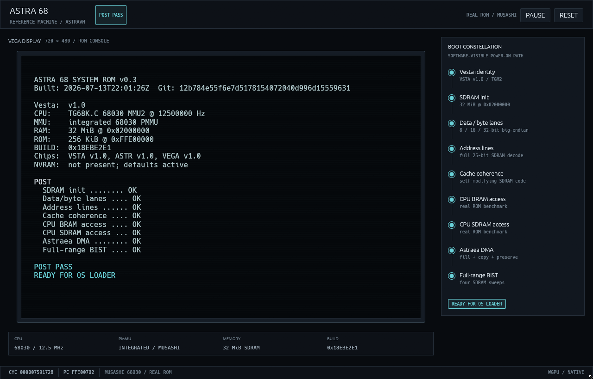

# AstraVM

AstraVM is the native desktop reference machine for Astra 68. It executes the
unchanged boot ROM on the vendored Musashi 68030/PMMU core, behind a modeled
Astra bus and the MMIO devices needed by POST. The 90x30 Vega ROM console sits
inside the 720x480 display surface in a native Rust `eframe`/`egui`/`wgpu` UI.



The machine crate is deliberately headless. The desktop app paces it from a
dedicated worker thread and receives bounded snapshots; UI rendering is not
part of machine state or virtual time.

## Build and test

The workspace pins Rust 1.97.0. Install it through rustup once on each build or
desktop host:

```sh
rtk make -C emu toolchain
```

Per the project execution topology, perform repeatable builds on `beast` or
`nuc`:

```sh
cd emu
rtk make fmt
rtk make check
rtk make test
rtk make build
```

Run the unchanged ROM to completion without a window:

```sh
rtk make post
```

Run natively on a desktop with a GPU/windowing session:

```sh
cd emu
rtk make run
```

`RESET` replays POST and `PAUSE` freezes virtual time. The machine worker never
waits on UI rendering: commands and snapshots cross bounded channels, while
the host renderer consumes only the newest available snapshot.

`READY FOR OS LOADER` is a milestone exposed in snapshots, not a machine halt.
The CPU continues executing the ROM and can proceed into a future loader; only
a POST failure is terminal to an execution slice.

The default ROM is an intentionally checked-in, embedded artifact and its
provenance is recorded in
[`rom/README.md`](rom/README.md). To exercise a newly built image without
recompiling AstraVM:

```sh
rtk env ASTRA68_BOOT_ROM=../sw/boot/astra_boot.bin make run
```

The current emulated hardware slice covers reset aliasing, ROM, BRAM, SDRAM,
Vesta identity/UART/BIST, Vega bootstrap text, and Astraea POST fill/copy. New
devices should be added behind the same headless bus boundary with focused unit
tests before their UI tooling is introduced. The cross-host test matrix and
explicit model boundaries are recorded in [`RESULTS.md`](RESULTS.md).

MC68030 PMMU descriptor traffic uses a separate fallible physical-bus path.
Mapped Astra apertures return data; an unmapped table address reports a
table-bus fault instead of silently returning a zero descriptor.
