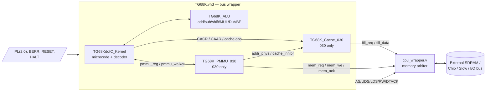
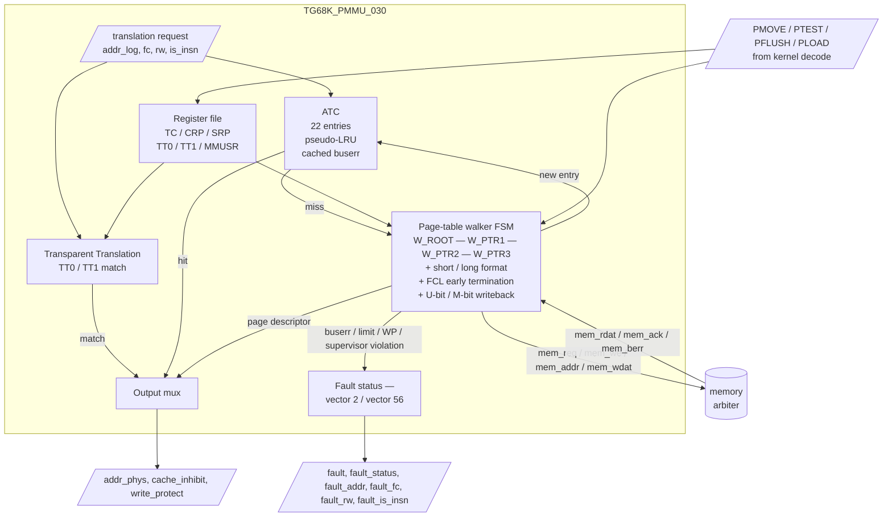
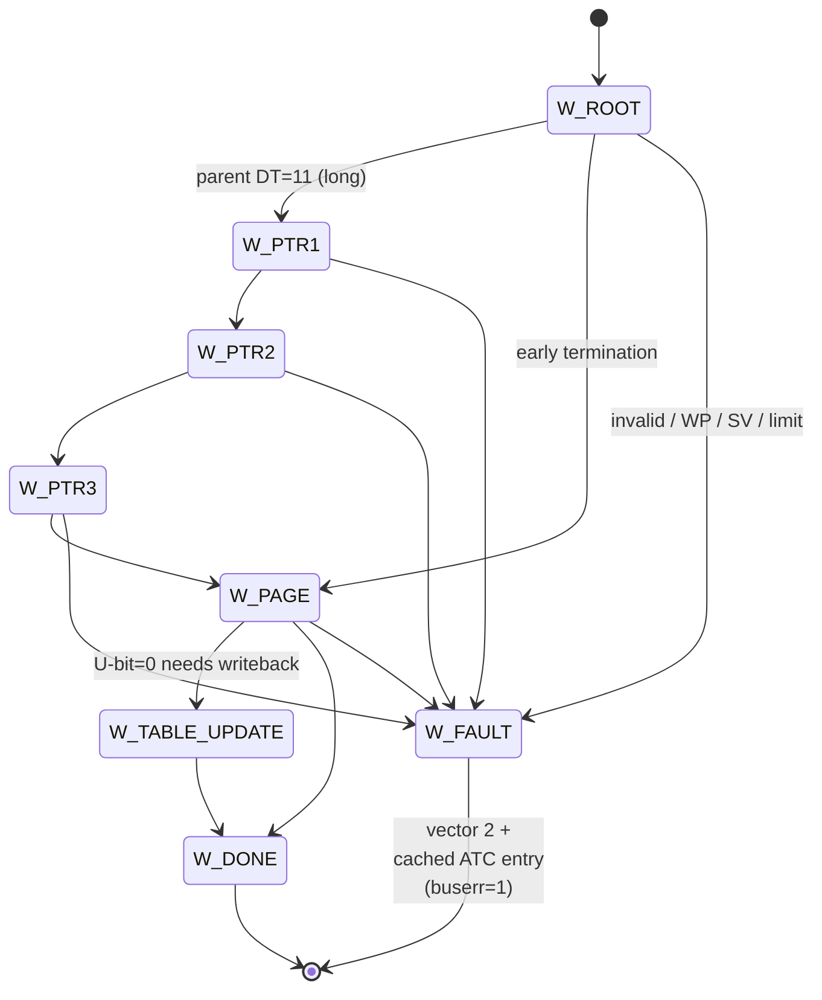

# TG68K.C — `030_mmu` branch

A **68030** soft core for FPGAs, derived from
Tobias Gubener's TG68K.C. This branch adds a working **MC68030 mode** with a
full MMU (PMMU) and on-chip caches, suitable for running 68030-class Amiga
software (Workbench 3.x, `mmu.library`, `setpatch`, `Scout`, `SysInfo`,
`VATestProgram`, DiagROM, ...).

The original TG68K.C philosophy still holds — the core is not cycle-accurate;
it trades a few cycles for a far smaller FPGA footprint than a true 68030
clone, while remaining behaviorally compatible at the instruction, exception,
and bus-fault level.

> **Status (April 2026):** Boot path verified against DiagROM, AmigaOS 3.1/3.9,
> `mmu.library`, `Scout`, `VATestProgram`, and an extensive WinUAE-derived
> `cputest` corpus. 116 testbenches in `tests/tg68k_030/` cover instruction
> semantics, PMMU translation, ATC behaviour, exception frames, RTE/ABCD
> M-bit transitions, lockup/race scenarios, and real software boot
> sequences.

---

## Contents

- [What's new in `030_mmu`](#whats-new-in-030_mmu)
- [Architecture](#architecture)
  - [Top-level block diagram](#top-level-block-diagram)
  - [PMMU internals](#pmmu-internals)
  - [Cache organisation](#cache-organisation)
  - [Page table walker FSM (high-level)](#page-table-walker-fsm-high-level)
- [File layout](#file-layout)
- [Detailed change log](#detailed-change-log)
  - [TG68KdotC_Kernel.vhd](#tg68kdotc_kernelvhd)
  - [TG68K_PMMU_030.vhd](#tg68k_pmmu_030vhd)
  - [TG68K_Cache_030.vhd](#tg68k_cache_030vhd)
  - [TG68K_Pack.vhd](#tg68k_packvhd)
  - [TG68K_ALU.vhd](#tg68k_aluvhd)
  - [TG68K.vhd](#tg68kvhd)
- [Testbenches](#testbenches)
  - [Running tests with `make`](#running-tests-with-make)
  - [Test suite map](#test-suite-map)
- [Integration notes](#integration-notes)
- [Known limitations](#known-limitations)
- [Credits](#credits)

---

## What's new in `030_mmu`

Everything below is additive on top of the upstream `master`/`030` branches.
The 68000/68010/68020 have been replaced with 68030, if you need them,
just use the real tg68k.

- **MC68030 mode (`CPU="10"`).** Full PMMU, on-chip cache control, 030 stack
  frames (Format `$0`, `$1`, `$2`, `$9`, `$A`, `$B`), 64-bit CRP/SRP, MOVES
  with SFC/DFC, MMUSR, separate MSP/ISP, the lot.
- **`TG68K_PMMU_030.vhd` — new module.** A fully-walking PMMU with
  `TC`/`CRP`/`SRP`/`TT0`/`TT1`/`MMUSR` registers, transparent translation,
  short- and long-format descriptors, FCL early termination, page sizes
  256B–32KB, 22-entry ATC (matches real silicon) with pseudo-LRU
  replacement, U-bit / M-bit writeback, write-protect accumulation,
  cached-fault entries, and full `PMOVE` / `PTEST` / `PFLUSH` /
  `PLOAD` / `PFLUSHR` semantics.
- **`TG68K_Cache_030.vhd` — new module.** 256-byte instruction cache plus
  256-byte data cache, both direct-mapped with 16-byte lines, physically
  indexed and physically tagged, driven by CACR (`IE`/`DE`/`IBE`/`DBE`/
  `WA`/`FI`/`FD`/`CI`/`CD`/`CEI`/`CED`) and by `CINV`/`CPUSH` line/page/all
  scopes via `CAAR`. Cache-inhibit lines from PMMU and TT registers are
  honored per-access.
- **Bus-error / address-error / MMU-fault frames** rebuilt to match the
  MC68030 SSW layout, including correct FB/FC/RB/RC/DF/RM bits, distinct
  vectors for instruction vs. data faults, vector 2 dispatch for ATC
  buserr hits, vector 56 for MMU configuration errors, and Format `$A`
  vs. `$B` selection driven by access type rather than instruction class.
- **Exception/RTE rework** for M-bit/S-bit transitions, MSP/ISP active-A7
  aliasing, format-error CCR restoration, trace stacking for Group 2
  exceptions, and odd-address branch / odd-PC handling.
- **`MOVEC`/`MOVES`** with SFC/DFC, illegal-register trap, latched
  selector across immediates, active-stack aliasing for ISP/MSP/USP, and
  privilege checks that match real 030 behaviour (vector 8 in user mode).
- **`PMOVE` / `PTEST` / `PFLUSH` / `PLOAD`** decode for all legal EA modes
  (Dn, (An), (An)+, -(An), (d16,An), (d8,An,Xn), (xxx).W/.L, (d16,PC),
  (d8,PC,Xn)), 64-bit CRP/SRP transfers via stack post-increment /
  pre-decrement, and a hardware trap on illegal `PMOVE` register selects.
- **Comprehensive ALU fixes** for the 020/030 paths, including
  `DIVS.L`/`DIVU.L`/`DIVU.W` flags, `CHK2` C/Z derivation, `STOP`
  reserved-SR-bit handling, `RTR`, `MOVEP` byte mirroring, `BRA.L`/`BSR.L`
  skipFetch handling, and `BFFFO`/`BFINS` width handling.
- **116 ModelSim testbenches** under `tests/tg68k_030/` exercising every
  feature above, plus `Makefile` aggregations
  (`test-comprehensive`, `test-real`, `test-arch-suite`, `test-fault`,
  `test-stress`, `test-lockup-all`, ...).

---

## Architecture

### Top-level block diagram

`TG68K.vhd` is the bus wrapper. It instantiates `TG68KdotC_Kernel`
(microcode-driven core), `TG68K_ALU` (arithmetic/shifter/bitfield/MUL/DIV),
and — when `CPU="10"` (68030) — `TG68K_PMMU_030` and `TG68K_Cache_030`.
The cache is fronted by an external memory arbiter in `cpu_wrapper.v`
(part of the integrating top, not in this repo).



### PMMU internals

`TG68K_PMMU_030.vhd` accepts a translation request from the kernel
(`req`/`is_insn`/`rw`/`fc`/`addr_log`) and answers with a physical address,
cache-inhibit and write-protect flags, and — on miss/fault — a fault status
that drives a vector-2 bus error frame in the kernel.



### Cache organisation

Both the I-cache and D-cache are 256 bytes, direct-mapped, with 16-byte
lines (16 lines each). They are physically indexed and physically tagged
(the PMMU translates first, the cache looks up second), so context
switches and PFLUSH do not require cache invalidation by themselves.

```
   Physical address (32 bits)
   ┌────────────────────────────┬──────────┬──────────┐
   │  tag (24 bits)             │ idx (4)  │ off (4)  │
   └────────────────────────────┴──────────┴──────────┘
                                    │           │
                                    ▼           ▼
                          ┌──────────────┐    byte select
                          │ tag / valid  │    inside the
                          │   array      │    16-byte line
                          └──────────────┘
                                    │
                          tag match  │ valid
                                    ▼
                                  i_hit / d_hit
```

CACR controls which cache is enabled (`IE`, `DE`), frozen (`FI`, `FD`),
write-allocated (`WA`), or burst-enabled (`IBE`, `DBE`). `CINV`/`CPUSH`
line/page/all scopes are driven from `CAAR` and the kernel's
`cache_op_scope` / `cache_op_cache` lines, with line-level precision when
the scope encoding asks for it (avoids the global-flush overhead of
earlier revisions).

### Page table walker FSM (high-level)

The walker handles both short-format (4-byte descriptors) and long-format
(8-byte descriptors), automatically promoting to a stride of 8 when a
parent descriptor has `DT=11`. With `FCL=1` and a non-zero `TID`, walks
extend to a fifth level (FC → TIA → TIB → TIC → TID → page); with
`FCL=1`/`TID=0` the FC field becomes level 0.



Key invariants:
- **Stride is per parent descriptor.** A short root with a long pointer
  table or vice versa is walked correctly (BUG #409).
- **Write-protect accumulates.** `WP=1` anywhere on the path marks the
  ATC entry as write-protected; subsequent writes raise vector 2 from
  the ATC layer (matches WinUAE).
- **U-bit writeback** is staged through `W_TABLE_UPDATE`; PTEST with
  `A=0` skips it (diagnostic mode).
- **M-bit miss invalidation.** A write to a page with `M=0` invalidates
  the ATC entry so the next walk re-fetches and writes back `M=1`.
- **PLOAD flushes first**, then walks — matches MC68030 spec & WinUAE.
- **ATC bus-error caching.** Invalid / supervisor-violation / limit
  faults are cached in the ATC with a `buserr` bit, so subsequent
  accesses fault from the ATC without re-walking.

---

## File layout

| File | Role |
|------|------|
| `TG68K.vhd` | Top-level wrapper. Drives the 68K asynchronous bus (`AS`/`UDS`/`LDS`/`RW`/`DTACK`/`VPA`/`VMA`), instantiates the kernel + ALU + (in 030 mode) PMMU and cache. Adds the cache memory interface (`cache_req`/`cache_addr`/`cache_data`/`cache_ack`/`cache_burst`/`cache_burst_len`) and `cache_hit`/`cache_miss` debug outputs. |
| `TG68KdotC_Kernel.vhd` | Microcode-driven core. Decodes opcodes, sequences `micro_states`, manages PC/SR/USP/SSP/MSP/ISP/VBR/SFC/DFC/CACR/CAAR, exception entry/exit, all stack frames, the PMMU instruction interface, MOVES, MOVEC, cpSAVE/cpRESTORE, and the bus state machine. 030-specific behaviour gates on `CPU(0)` / `CPU(1)` per the existing TG68K convention. |
| `TG68K_ALU.vhd` | Arithmetic, shifter, bit-field, MUL/DIV (16/32-bit), CHK/CHK2, BCD/PACK/UNPACK. |
| `TG68K_PMMU_030.vhd` | **New.** MC68030 PMMU. See [PMMU internals](#pmmu-internals). |
| `TG68K_Cache_030.vhd` | **New.** MC68030 on-chip caches. See [Cache organisation](#cache-organisation). |
| `TG68K_Pack.vhd` | Shared types and component declaration. Adds `pmove_*`, `ptest1`/`ptest2`, `pflush1`, `pload1`, `pmmu_*` micro-states and `pmmu_rd`/`pmmu_wr`/`pmmu_ptest`/`pmmu_pflush`/`pmmu_pload`/`use_sfc_dfc`/`sfc_not_dfc`/`pmmu_addr_inc`/`pmmu_dbl`/`to_SSP`/`from_SSP`/`to_MSP`/`from_MSP`/`to_ISP`/`from_ISP` opcode-vector bits. `lastOpcBit = 103`. |
| `TG68K.qip` | Quartus IP file listing all five VHDL sources. Drop the folder into a Quartus project and add `TG68K.qip` to the QSF. |

---

## Detailed change log

### TG68KdotC_Kernel.vhd

The kernel is the largest single file in the tree (~10k lines). The 030
work spans both visible behaviour and a number of corner-case bug fixes;
the most material items:

**MMU integration**
- `pmmu_reg_we`/`pmmu_reg_re`/`pmmu_reg_sel`/`pmmu_reg_wdat`/`pmmu_reg_part`
  drive `TG68K_PMMU_030`'s register port from the `PMOVE` decoder.
  `reg_sel` is `brief(14:10)`: `00010=TT0`, `00011=TT1`, `10000=TC`,
  `10010=SRP`, `10011=CRP`, `11000=MMUSR`. Anything else triggers the
  hardware illegal-`PMOVE` trap (BUG #446) and lights `debug_illegal_reg_sel`
  for SignalTap forensics.
- `pmmu_walker_req`/`_we`/`_addr`/`_wdat`/`_ack`/`_data`/`_berr` form a
  separate memory port for the table walker (arbitrated externally by
  `cpu_wrapper.v`).
- Translation request (`pmmu_addr_log`, `fc`, `is_insn`, `rw`) is issued
  on every memory cycle; the kernel waits for `addr_phys` before driving
  the external bus and respects `pmmu_cache_inhibit` per-access.

**PMOVE / PTEST / PFLUSH / PLOAD**
- New micro-states `pmove_decode`, `pmove_mem_to_mmu_hi/_lo`,
  `pmove_mmu_to_mem_hi/_lo`, `pmove_dn_hi/_lo`, `pmmu_dn_read_wait`,
  `pmmu_ld_*`, `ptest1/2`, `pflush1`, `pload1`.
- 64-bit CRP/SRP transfers across (An), (An)+, -(An), (d16,An),
  (d8,An,Xn), (xxx).W/.L use the new `pmmu_addr_inc` and `pmmu_dbl`
  opcode bits to step by 4 internally and update An by 8 once per
  instruction.
- Read-modify-write (PMOVE Dn,...) gates Dn write-back through
  `pmmu_dn_read_wait` so the An base register cannot be clobbered by a
  parallel readback.

**MOVES / MOVEC**
- `use_sfc_dfc` / `sfc_not_dfc` opcode bits route MOVES through SFC for
  reads and DFC for writes. User-mode MOVES traps as privilege
  violation (vector 8).
- MOVEC selector latch survives later immediates so back-to-back MOVECs
  with the same source register sequence correctly. MOVEC ISP/MSP
  aliasing into the active A7 is honored for RTE.
- MOVEC accepts only the registers documented in MC68030 User's Manual
  Table 4-2: SFC ($000), DFC ($001), USP ($800), VBR ($801), and
  (68020+) CACR ($002), CAAR ($802), MSP ($803), ISP ($804). User-mode
  MOVEC traps as privilege violation (vector 8); a supervisor-mode
  MOVEC to any other register selector — including 040-style ITT0/DTT0
  /URP/SRP encodings — traps as illegal instruction (vector 4). All
  PMMU registers (TC, TT0, TT1, CRP, SRP, MMUSR) are PMOVE-only on
  the 68030 by design and are not addressable via MOVEC.

**Stack frames**
- Format `$0` (uniform group 1), `$1` (throwaway), `$2` (group-2 6-word
  with PC), `$9` (coprocessor mid-instruction), `$A` (short bus error),
  `$B` (long bus error), and the unimplemented-format trap path.
- For PMMU and external BERR paths the SSW layout was rebuilt:
  - `SSW(11:10) = "00"` (preserves bit 9, was clearing it).
  - Instruction fetch faults always select Format `$B` (regardless of
    cache vs. external).
  - Data faults set `FC=1`/`RC=1` (stage C, rerunnable); instruction
    faults set `FB=1`/`RB=1`.
  - External BERR distinguishes insn vs. data via `berr_external_fc(0)`.
  - Address-error frames no longer set spurious `FB=1`/`RB=1` from an
    odd-PC trap.
  - `RM` reflects `exec_tas` for TAS read-modify-write faults.

**Trace / Group-2 / odd-address handling**
- `trace_stk_grp2` micro-state for stacking T0/T1 traces around CHK,
  CHK2, DIV/0, TRAP, TRAPcc, JMP/JSR variants. Verified against the
  packed BASIC `cputest` corpus.
- Odd-address branch/JSR sequences keep MSP/ISP integrity through the
  resulting address error.

**RTE / M-bit / S-bit**
- RTE format-error path restores CCR (BUG #397) so the next instruction
  sees the correct flag image.
- M-bit / S-bit transitions switch the active A7 between USP/ISP/MSP
  per the 020/030 spec; ABCD interaction with M-bit stack mode
  switching is covered by `tb_rte_mbit_abcd` and `tb_abcd_mbit`.

**ALU/flag fixes that landed in the kernel**
- `STOP` clears reserved SR bits per spec.
- `DIVS.L`/`DIVU.L` flag composition fixed; `DIVU.W` zero-divide flags
  use the latched dividend on 020/030.
- `CHK2` C/Z derive from the final range comparison.
- `MOVEP` byte mirroring fixed (BUG: latched data byte was reused for
  the next byte slot).
- `BRA.L`/`BSR.L` `skipFetch` bug fixed.

**Other**
- Bus-Timeout BERR implementation removed — it was tripping on demos
  whose timing pushed the chip-bus state machine past the watchdog
  threshold. Bus errors are now driven exclusively by the PMMU and by
  the external `BERR` line.
- CACR cache invalidation (`CEI`/`CED`) uses line-level scope with the
  `CAAR` address instead of always doing a global invalidation.

### TG68K_PMMU_030.vhd

The PMMU is the largest single module in the 030 work (~5k lines). Key
properties:

**Registers** — all PMOVE-accessible per MC68030 spec:
- `TC` (32-bit, with `EN`, `PS`, `IS`, `FCL`, `TIA-TID`).
- `CRP_H`/`CRP_L`, `SRP_H`/`SRP_L` (64-bit each, transferred as two
  longwords).
- `TT0`, `TT1` (32-bit, with FC mask/match, R/W match, CI/WP bits).
- `MMUSR` (16-bit; high word zero when read as a longword).
- Reserved-bit write masks for TC/TT0/TT1/CRP/SRP so software cannot
  poke bits the real chip ignores.
- CAL/VAL/SCC/AC are intentionally not implemented — unused by all
  Amiga software in our test corpus.

**Address Translation Cache (ATC)**
- 22 entries (matches real MC68030 silicon).
- Pseudo-LRU replacement: an MRU bit per entry, all reset when full,
  replace the first entry with `MRU=0` (matches WinUAE
  `mmu030_atc_handle_history_bit`).
- Always stored at `TC.PS` page granularity. With early termination,
  unused table-index bits are folded into the physical address as an
  offset (matches WinUAE `unused_fields_mask`).
- Bus-error caching: invalid / supervisor-violation / limit faults are
  stored with a `buserr` bit so the next access faults out of the ATC
  without re-walking.
- M-bit miss invalidation: a write to an entry with `M=0` invalidates
  the entry via `atc_mbit_inval_req` so the walker re-fetches and
  writes back `M=1`.
- 1-cycle guard blocks ATC hits the cycle a flush request arrives
  (BUG: stale `addr_phys_reg`).

**Walker**
- Handles short (4-byte) and long (8-byte) descriptor strides per
  parent descriptor's `DT` field (BUG #409).
- FCL = 0 / 1, TID = 0 / non-zero — supports up to 5 levels with
  proper page-shift calculation (`calc_effective_page_shift`).
- `walk_write_protect` accumulates WP across all levels (MC68030 spec
  9.5.2). Walker no longer aborts on WP violations; instead it
  completes and creates an ATC entry with `WP=1`, and the ATC-level
  check produces vector 2 on writes (BUG #437).
- Early termination: limit check against the next table index; if the
  parent descriptor terminates early, the unused bits are folded into
  the page offset.
- `W_TABLE_UPDATE` writes back `U=1` (and gated `M=1`) descriptors;
  PTEST with `A=0` skips this step.
- Walker fault paths preserve the **first** logical address so the
  bus-error stack frame addresses the original access, not a later
  speculative one.

**Transparent translation (TT0/TT1)**
- Combinational TT bypass for both `cache_inhibit` and `write_protect`,
  so TT-matched accesses skip the ATC entirely.
- TT0/TT1 stay active when `TC.E=0`, matching real-silicon behaviour
  during the boot sequence before the OS enables the MMU.

**Faults**
- Vector 2 (bus error) for ATC buserr hits and walker faults
  (invalid descriptor, SV violation, limit violation, WP-violating
  write). The previous code routed walker B-bit faults to vector 61
  (`$F4`); on MC68030 that's reserved/unassigned and was breaking
  `mmu.library` (BUG #435).
- Vector 56 (MMU configuration error) when invalid configurations are
  programmed (e.g. `DT=0` at a level the walker reaches), gated on
  `mmu_config_ack` so the kernel can drain the trap before the next
  request.

**Reset / disable**
- PMMU enable bits cleared on hardware RESET.
- `tc_enable` reflects `TC[31]` (the `E` bit) but TT0/TT1 stay live
  when E=0.

**Debug**
- ~30 `debug_*` ports for SignalTap (TC/TT0/TT1/CRP/SRP/MMUSR, walker
  state, ATC valid/buserr vectors, sticky per-level descriptor
  captures, illegal-PMOVE latch, saved fault address/FC).

### TG68K_Cache_030.vhd

- 256-byte instruction cache + 256-byte data cache, direct-mapped, 16
  lines × 16 bytes each.
- Physically indexed, physically tagged. The PMMU's `addr_phys` drives
  both the index and the tag (`addr_phys[31:8]`).
- Latched line index and tag on fill request (BUG #131): a downstream
  address change before fill completes does not corrupt the line.
- Cache-inhibit lines (`i_cache_inhibit`/`d_cache_inhibit`) come from
  the PMMU/TT and skip cache lookup entirely.
- `cache_op_scope` = line / page / all, `cache_op_cache` = both / data
  / insn / both, `cache_op_addr` = `CAAR`. Line scope masks at
  `addr[7:4]`; page scope masks at `addr[31:8]`.
- 128-bit fill data (`fill_data[127:0]`) — one 16-byte line per fill.
  The integrating top is responsible for bursting four longwords from
  memory into the cache.

### TG68K_Pack.vhd

- Adds the `pmove_*`, `pmmu_*`, `ptest*`, `pflush*`, `pload*` micro-states
  and the `to_SSP`/`from_SSP`/`to_MSP`/`from_MSP`/`to_ISP`/`from_ISP`
  states that drive the M-bit/S-bit A7 alias plumbing.
- New opcode-vector bits at indices 89–103: `pmmu_rd`, `pmmu_wr`,
  `pmmu_ptest`, `pmmu_pflush`, `pmmu_pload`, `to_SSP`, `from_SSP`,
  `to_MSP`, `from_MSP`, `to_ISP`, `from_ISP`, `use_sfc_dfc`,
  `sfc_not_dfc`, `pmmu_addr_inc`, `pmmu_dbl`. **`lastOpcBit = 103`** —
  if you regenerate decode tables, regenerate against this width.

### TG68K_ALU.vhd

- 020/030 DIV/MUL paths fixed (`DIVS.L`/`DIVU.L`/`DIVU.W` flag
  composition; latched dividend for zero-divide flags).
- `CHK2` C/Z derived from final range comparison.
- BFFFO/BFINS width handling.
- `restore_ccr` / `restored_ccr_value` ports for the kernel's RTE
  format-error path (BUG #397).

### TG68K.vhd

- 030 cache memory interface added: `cache_req`, `cache_addr`,
  `cache_data`, `cache_ack`, `cache_burst`, `cache_burst_len[2:0]`,
  `cache_hit`, `cache_miss`.
- Component declaration of `TG68KdotC_Kernel` widened to mirror the
  kernel's expanded port list (PMMU register port, walker port, CACR
  bits, debug ports).

---

## Testbenches

The repo this branch is cut from carries 116 ModelSim testbenches in
`tests/tg68k_030/` (113 VHDL `tb_*.vhd`, 3 SystemVerilog `tb_*.sv`
wrappers, plus a Verilog `tb_cpu_wrapper_pmmu.v`). They run against the
**actual** RTL — no mocked CPU, no fake PMMU. Helper scripts under the
same directory (`build_cputest_mem.py`, `build_cputest_sparse_mem.py`,
`audit_div_cputest.py`, `decode_cputest_dat.py`, `replay_cputest_basic.py`,
`export_div_wrapper_cases.py`) generate `.mem` images from WinUAE
`cputest` golden traces.

> The testbench files themselves live in
> [`Minimig-AGA_MiSTer/tests/tg68k_030/`](https://github.com/apolkosnik/Minimig-AGA_MiSTer/tree/030_mmu2/tests/tg68k_030)
> — they're not part of this `TG68K.C` checkout because they pull in
> integration-side helpers (`cpu_wrapper.v`, `altsource_probe_stub.v`,
> Quartus-IP-shaped memories). The Makefile expects to find the RTL one
> level up at `../../rtl/tg68k/`.

### Running tests with `make`

Prerequisite: ModelSim ASE (free edition) is expected at
`/opt/intelFPGA_lite/17.0/modelsim_ase` — adjust the `MODELSIM_PATH`
variable at the top of `tests/tg68k_030/Makefile` if yours lives
elsewhere.

```bash
cd Minimig-AGA_MiSTer/tests/tg68k_030

# one-time work-library setup (idempotent)
make setup

# fast VHDL syntax check (no simulation)
make syntax-check

# the headline aggregate — runs the maintained PMMU + fault + lockup suites
make test-comprehensive

# everything that maps to a real software boot sequence
make test-real

# regression sweep used as a CI gate before tagging
make test-regression

# enumerate every target with a one-line description
make help
```

Individual benches are runnable on their own — useful when you're
debugging a specific behaviour:

```bash
make test-pmmu-walker          # 7-test page table walker suite
make test-pmmu-atc             # 10-test ATC suite (replacement, M-bit, buserr cache)
make test-mmu-translation      # walker + ATC + TT integration
make test-cache                # 256B I + D cache
make test-cacr                 # CACR bit semantics
make test-mmu-fetch-fault-frame   # PMMU instruction fault → Format $B vector 2
make test-mmu-user-data-fault-recovery  # user-mode data fault → vector 2 + RTE
make test-lockup-all           # 5 deadlock/race scenarios
make test-rte-abcd-suite       # all RTE formats + M-bit + ABCD interactions
```

Most targets dump a `transcript`/`.wlf` next to the Makefile;
`test-regression` additionally writes `mc68030_regression_results.log`.

### Test suite map

Targets are organised into a few layered aggregates (see `make help` for
the full list of ~130 targets):

| Aggregate | Covers |
|-----------|--------|
| `test-comprehensive` | `test-advanced` + `test-fault` + `test-lockup-all`. Default `make all` target. |
| `test-real` | `test-diagrom-detectcpu`, `test-cpu-mmu-detection`, `test-mmu-library-detect`, `test-mmu-library-failure-path`, `test-mmu-library-root-probe`, `test-mmu-library-enable-probe`, `test-68030-library`, `test-whichamiga`, `test-amiga-sequence`. Real software boot sequences. |
| `test-advanced` | `test-pmmu-walker`, `test-pmmu-atc`, `test-mmu-translation`. PMMU functional core. |
| `test-fault` | `test-fault-recovery`, `test-mmu-fetch-fault-frame`, `test-berr-frame`, `test-addr-error-pmmu`. Fault frames + recovery. |
| `test-stress` | `test-mmu-translation`, `test-lockup-all`. Translation + race coverage. |
| `test-arch-suite` | RTE/ABCD + branch / odd-addr / odd-IRQ + BASIC cputest + MOVEC + cpSAVE/cpRESTORE + MOVES + PTEST history bits. All architecture edge-cases. |
| `test-rte-abcd-suite` | All RTE stack frame formats + M-bit/S-bit + ABCD interaction + ISP/MSP. |
| `test-trace-suite` | T0/T1/Group-2 stacked traces + JMP 65B2 trace. |
| `test-mmu-instruction-suite` | PMOVE addressing modes + PFLUSH/PTEST/PLOAD + indirect descriptors + Amiga sequence. |
| `test-basic-cputest` | Maintained packaged BASIC opcode coverage for CHK/DIV/JMP/TRAP/TRAPcc. |
| `test-lockup-all` | Walker timeout, bus conflict, cache-fill starvation, ATC handshake, mem-ack races. |
| `test-regression` | `tb_mc68030_regression.vhd` end-to-end gate. |

A non-exhaustive selection of single-purpose benches (each backed by one
`tb_*.vhd`):

| Area | Benches |
|------|---------|
| **PMOVE encoding / EA modes** | `tb_pmove_addressing_modes`, `tb_pmove_tc_corner`, `tb_pmove_tc_read`, `tb_pmove_tt0_read`, `tb_pmove_tt0_mem_read`, `tb_pmove_tt1_mem`, `tb_pmove_readback_guard`, `tb_pmove_d16an_pc`, `tb_pmove_d8anxn_pc`, `tb_pmove_pc_all_regs`, `tb_pmove_all_modes`, `tb_pmove_crp_a7_postinc`, `tb_pmove_crp_mem_to_mmu_postinc`, `tb_pmove_comprehensive`, `tb_pmove_multiple_regs_from_a7`, `tb_bug95_pmove_dn`, `tb_bug95_pmove_ea_pc` |
| **PTEST / PFLUSH / PLOAD** | `tb_pflush_ptest_pload`, `tb_ptest_history_bits`, `tb_ptest_all_modes`, `tb_pload_all_modes`, `tb_pflush_all_modes`, `tb_indirect_descriptor` |
| **Walker / ATC** | `tb_pmmu_*`, `tb_mmu_translation`, `tb_amiga_mmu_sequence`, `tb_lockup_walker_timeout`, `tb_lockup_bus_conflict`, `tb_lockup_cache_fill`, `tb_lockup_atc_handshake`, `tb_lockup_mem_ack_race` |
| **Faults / frames** | `tb_berr_frame`, `tb_addr_error_pmmu`, `tb_addr_error_pmmu_data`, `tb_addr_error_mmu_badfeed`, `tb_mmu_fetch_fault_frame`, `tb_mmu_fault_recovery`, `tb_mmu_badfeed_fault_frame`, `tb_mmu_badfeed_softfix_recovery` |
| **Cache** | `tb_cache_030`, `tb_cacr_test`, `tb_cacr_freeze_test`, `tb_movec_cacr_corner` |
| **MOVEC / MOVES / cpSAVE** | `tb_movec_active_stack`, `tb_movec_selector_latch`, `tb_movec_illegal`, `tb_moves_validation`, `tb_moves_all_modes`, `tb_moves_privilege`, `tb_moves_d16an_pc`, `tb_cpsave_cprestore_exceptions` |
| **Stack frames / RTE** | `tb_rte_formats`, `tb_rte_mbit_abcd`, `tb_abcd_mbit`, `tb_abcd`, `tb_stack_frame_push`, `tb_interrupt_mode_stack` |
| **Trace / Group 2** | `tb_group2_t0_trace`, `tb_group2_t1_trace`, `tb_chk_stacked_trace`, `tb_basic_chk_trace`, `tb_basic_div_jmp_trace`, `tb_basic_chk2_*`, `tb_basic_jmp_*`, `tb_jmp_65b2_trace_regression`, `tb_jmp_65b2_index_target`, `tb_jmp_record37_ori_tail`, `tb_jmp_bus_trace`, `tb_jmp_debug` |
| **Real software boots** | `tb_diagrom_*`, `tb_cpu_mmu_detection`, `tb_68030_library_init`, `tb_whichamiga_mmu`, `tb_mmu_library_detect`, `tb_mmu_library_failure_path`, `tb_mmu_library_enable_probe`, `tb_amiga_mmu_sequence` |
| **Odd-address / branches** | `tb_branch_odd_addr`, `tb_chk_long_odd_addr`, `tb_odd_irq_regwrite`, `tb_basic_exception_flags` |
| **Probes / regression gates** | `tb_mc68030_regression`, `tb_div_rtr_frame_probe`, `tb_default_div_rtr_exact`, `tb_divl_default_corpus`, `tb_longword_write_order`, `tb_sysreg_trap_capture`, `tb_sysreg_frame_capture`, `tb_tc_82a08680` |

---

## Integration notes

To drop this into a Quartus project:

1. Add the folder to your QSF via `set_global_assignment -name QIP_FILE
   .../tg68k/TG68K.qip` — that pulls in all five VHDL sources in the
   right order.
2. Wire `TG68K.vhd`'s 68K bus to your existing chip-bus state machine
   (the Minimig-AGA tree uses `cpu_wrapper.v`).
3. Wire the 030 cache port (`cache_*`) to a memory arbiter that can
   serve 16-byte bursts. The arbiter is also responsible for muxing
   walker requests (`pmmu_walker_*` on the kernel side, `mem_*` on the
   PMMU side via `cpu_wrapper.v`) against CPU requests.
4. Set `CPU = "10"` for 68030 mode. `"00"` (68000), `"01"` (68010), and
   the 68020 mode (driven by `CPU(1)` / `CPU(0)` per the upstream
   convention) are unaffected by this branch.

Trap on `mmu_config_err` — the kernel acks via `mmu_config_ack` once
the vector-56 frame is on the stack.

---

## Known limitations

- **CAL / VAL / SCC / AC are unimplemented.** None of the Amiga
  software in our test corpus touches them. PMOVE to those selects
  hits the illegal-`PMOVE` trap (BUG #446) — change the decode if you
  need them for other targets.
- **No 68040/060.** Branch is 030-specific. (68040+ exposes its MMU
  registers via MOVEC; on the 68030 the PMMU registers are
  PMOVE-only — see the MOVEC notes above — and this branch follows
  the 030 convention.)
- **Cache size is fixed at 256 B per cache.** Real silicon has the same
  256 B; this is faithful to the part, but you can scale up by
  changing `CACHE_SIZE` / `LINE_SIZE` constants in
  `TG68K_Cache_030.vhd`.
- **Not cycle-accurate.** Same trade-off as upstream TG68K.C.

---

## Credits

- Tobias Gubener — original TG68K.C core (68000/010/020).
- MikeJ, Till Harbaum, Rok Krajnk, robinsonb5, gyurco, ... — upstream
  patches that this branch builds on.
- Adam Polkosnik (this branch) — 68030 mode, PMMU, cache, exception /
  fault / RTE rework, testbench corpus.

Reference material used while building / debugging:
- *MC68030 User's Manual* (Motorola, 3rd ed.).
- *MC68030 Designer's Handbook*.
- WinUAE 030 PMMU implementation (cross-validation reference for ATC,
  walker, and stack-frame edge cases).
- Traces against DiagROM,
  `mmu.library`, `Scout`, `VATestProgram`, AmigaOS 3.1 / 3.9.

Released under the same LGPL-3.0+ licence as upstream TG68K.C.
